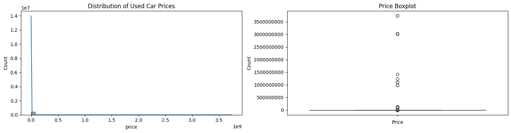
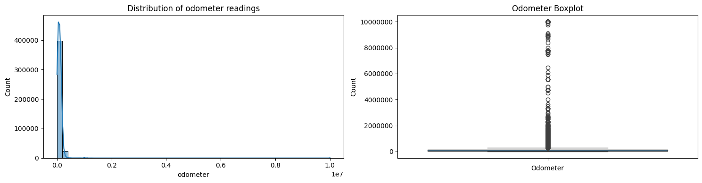
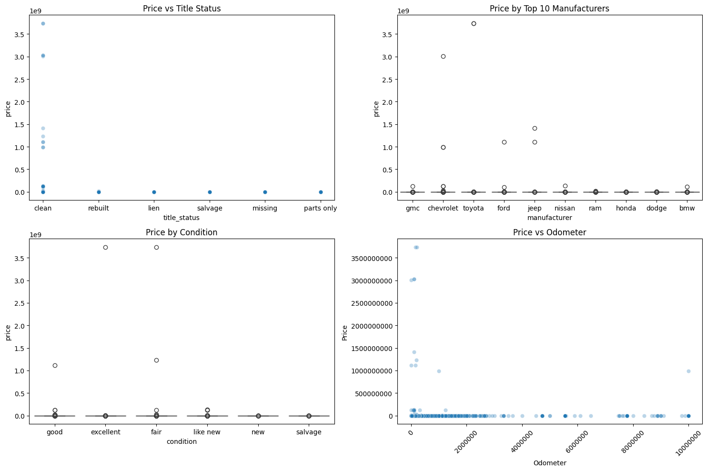
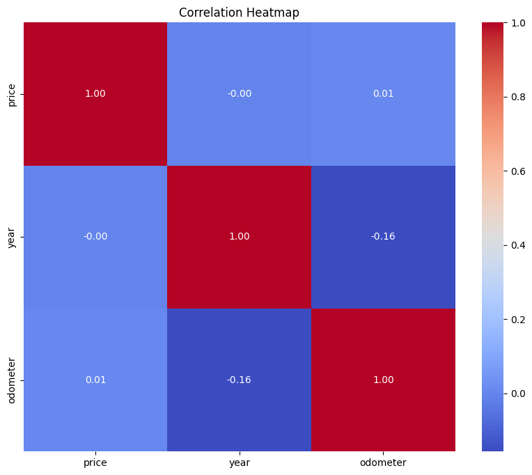
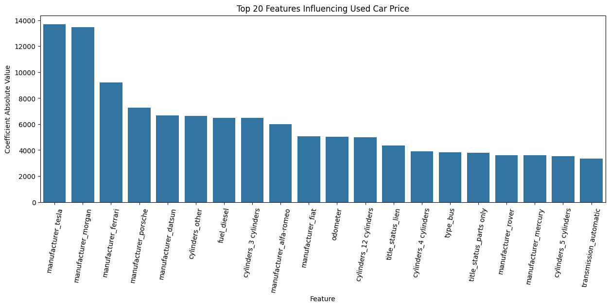

# Required Assignment 11.1: What Drives the Price of a Car?

## Overview
The goal of this project is to understand what factors make a car more or less expensive using the data provided. As a result of our analysis, we should provide clear recommendations to our client -- a used car dealership -- as to what consumers value in a used car.

## Data
The dataset includes used car prices with attributes such as year, manufacturer, model, condition, cylinders, fuel, odometer, title status, region etc. The data is stored in a CSV file and analyzed in a Jupyter Notebook.

## Files
- [vehicles.csv](data/vehicles.csv): The dataset used for the analysis.
- [prompt_II.ipynb](prompt_II.ipynb): The Jupyter Notebook containing the analysis and visualizations.

## Instructions
1. Clone this repository.
2. Open `prompt_II.ipynb` in Jupyter Notebook or any compatible IDE.
3. Run the cells to explore the dataset and visualize the results.

## Analysis
For this analysis we will use CRISP-DM Framework. Different steps of the framework are listed below

### Step 1: Business Understanding
- **Objective**: From data perspective, the task is to develop a predictive modeling framework to identify and quantify the key features that influence used car prices. This involves formulating a supervised regression problem where the target variable is the car price, and the input features may include attributes such as year, manufacturer, model, condition, cylinders, fuel, odometer,  title status, region etc. The objective is to use exploratory data analysis (EDA), feature engineering, and model training to identify the most impactful variables and accurately predict used car prices.

- **Questions**: What factors (e.g., year, manufacturer, model, condition, etc.) significantly affect the price of used cars?

### Step 2: Data Understanding
- **Load the Data**: Read the CSV file into a DataFrame.
- **Explore the Data**: AS part of data exploration we check the structure, data types, and summary statistics of the dataset.

  - Original dataset contains 426879 rows and 18 columns. 
  - From Summary statistics its clear the data has lot of invalid/outliers in price and odometer columns.

### Step 3: Data Preparation
- **Data Cleaning**: In this step we will determine how to handle missing values, incorrect data types, and outliers.

    - Based on box plots and Histogram of Price and Odometer data there are a lot of outliers which are not even valid values. As these outliers skew the analysis we can delete the outliers.
    #### Price Distribution
    

    #### Odometer Distribution
    

    #### Price Vs Other Attributes
    

    #### Correlation Matrix for Numerical features
    

    #### Missing Data Analysis
    | Column         | % Null Values |
    |----------------|---------------|
    | size           | 71.77         |
    | cylinders      | 41.62         |
    | condition      | 40.79         |
    | VIN            | 37.73         |
    | drive          | 30.59         |
    | paint_color    | 30.50         |
    | type           | 21.75         |
    | manufacturer   |  4.13         |
    | title_status   |  1.93         |
    | model          |  1.24         |
    | odometer       |  1.03         |
    | fuel           |  0.71         |
    | transmission   |  0.60         |
    | year           |  0.28         |
    | region         |  0.00         |
    | id             |  0.00         |
    | price          |  0.00         |
    | state          |  0.00         |

    - **id**, **VIN** will not influence the car price so we can drop those columns
    - **Size** is missing **72%** data, so it can be dropped 
    - **cylinders**, **condition** are missing for significant number of records but based on domain knowledge these will influence the price so we can keep them

- **Feature Selection**: Select relevant features for the analysis.
   - **state**, **region**, **model** may influence the price but as they have high cardinality and excluding them may not have significant negative impact so, for better performance we can drop those columns as well.
   - **Encoding Categorical Variables**: Convert categorical variables into numerical format using techniques like one-hot encoding.
- **Feature Scaling**: Normalize or standardize numerical features.

### Step 4: Modeling
- **Split the Data**: Divide the dataset into training and testing sets using test_size=0.2
- **Train the Model**: Use Lasso regression to train the model on the training set to determine significant features.
- **Evaluate the Model**: Assess the model's performance using Mean Squared Error (MSE).

    | Metric                             | Value            |
    |------------------------------------|------------------|
    | Training Score                     | 0.4758           |
    | Test Score                         | 0.4808           |
    | Mean Squared Error (Training Set)  | 86,861,417.92    |
    | Mean Squared Error (Test Set)      | 85,876,183.61    |

    From the metrics we can see our model performing better on test data.

    Perform Hyperparameter tuning using GridSearchCV
    
    | Parameter / Metric                          | Value              |
    |---------------------------------------------|--------------------|
    | lasso__alpha                                | 0.1                |
    | lasso__max_iter                             | 1000               |
    | Best Training Score                         | 0.4760             |
    | Best Test Score                             | 0.4811             |
    | Best Mean Squared Error (Training Set)      | 86,826,057.77      |
    | Best Mean Squared Error (Test Set)          | 85,832,487.56      |
    
    From the results its clear, the tuning didn't make much difference.

### Step 5: Evaluation
- **Interpret the Results**: Analyze the coefficients of the linear regression model to understand the influence of each feature on car prices.

Below table shows the top 20 features and the absolute value of the coefficients selected by our model

| Index | Feature                    | Coefficient       |
|-------|----------------------------|-------------------|
| 38    | manufacturer_tesla         | 13,691.21         |
| 30    | manufacturer_morgan        | 13,446.87         |
| 11    | manufacturer_ferrari       | -9,225.21         |
| 33    | manufacturer_porsche       | 7,267.79          |
| 9     | manufacturer_datsun        | 6,663.19          |
| 56    | cylinders_other            | -6,629.55         |
| 57    | fuel_diesel                | 6,496.73          |
| 51    | cylinders_3 cylinders      | -6,489.01         |
| 1     | manufacturer_alfa-romeo    | 6,012.78          |
| 12    | manufacturer_fiat          | -5,061.44         |
| 103   | odometer                   | -5,009.38         |
| 50    | cylinders_12 cylinders     | 4,995.22          |
| 63    | title_status_lien          | 4,362.26          |
| 52    | cylinders_4 cylinders      | -3,892.64         |
| 77    | type_bus                   | -3,815.64         |
| 65    | title_status_parts only    | -3,795.62         |
| 35    | manufacturer_rover         | 3,621.67          |
| 27    | manufacturer_mercury       | -3,593.34         |
| 53    | cylinders_5 cylinders      | -3,529.05         |
| 69    | transmission_automatic     | -3,353.95         |

- **Visualize the Results**: Below plot shows the relationships between features and prices.

### Step 6: Deployment
- Based on the analysis, features such as **manufacturer**, **cylinders**, **odometer**, **title status**, **type** and **transmission** play significant roles in determining a used car's price. This insight can guide dealerships to prioritize these attributes in listings and pricing algorithms.
#### Next Steps:
- The Analysis assumes a linear relationship between different features and price. A non-linear analysis may capture more variance and produce better score
